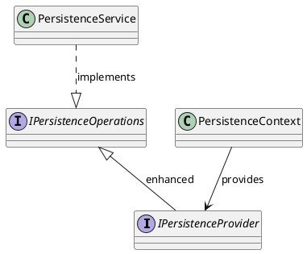
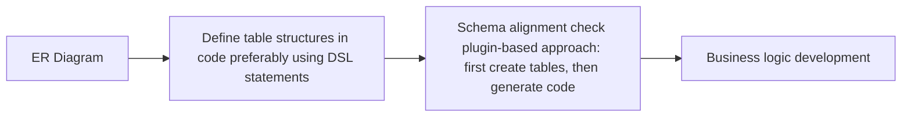

# **Fundamental Service Platform Construction Principles**

> **Cloud-Native Platform**  
> Emphasizes type-safe development practices.  
> Supports multiple programming languages, but Java remains the primary language for business
> logic.  
> The business layer will not involve multiple languages.  
> Uses **Tekton** for CI/CD.

---

## **Design Idea and implement Specification**

main database type only one type ,e.g. mysql,pg,oracle
and one service only datasource,If have other datasource,create sdk or other method
e.g. type graph database,vector database, I think is plugins
so persistence have one implement , one provider

search,cache,broadcast definition one rule
es,solr... implement rule

platform support ability

- persistence
- broadcast
- cache
- search
- task flow

package manage

```shell
├─annotations
├─broadcast
├─cache
├─config
├─constant
├─core
├─model
├─persistence
├─search
└─util
```



---

## **Fundamental Service Selection**

### **Search Service**

> searchCtx
> Currently, only **Elasticsearch** is considered.

### **Message Queue**

> broadcastCtx
> Evaluated **RabbitMQ, Kafka, RocketMQ, and Pulsar**.  
> Ultimately, **Pulsar** is chosen for most business use cases, while **Kafka** may be used for log
> collection.

### **Persistence Layer**

> persistenceCtx
> **PostgreSQL (PG)** is selected.

#### **ORM Framework**

> **JOOQ** is currently used, but a replacement is planned because it is **partially open-source
**.  
> JOOQ was chosen for its **type safety** and **fluent API** for writing SQL.

### **Caching**

> cacheCtx
> Currently, only **Redis** is considered, but it may be replaced in the future.

### **Network Communication**

> External communication via **HTTP**.  
> Inter-service communication across different languages uses **gRPC** (code generation for type
> safety).  
> Internal service **load balancing** is not yet implemented; **Istio** is being considered.

## How to Approach Business Development and Avoid Reinventing the Wheel

> Most common functionalities should be encapsulated in a plugin-based manner using interfaces, such
> as data masking, permissions, basic CRUD operations (multi-table references to be developed
> later),
> data archiving, etc.  
> Program based on interfaces and provide a series of default methods to prevent redundant
> development. Interfaces offer more flexibility compared to inheritance.

---

## Code and Database Synchronization Strategies

> Generally, the database table design process starts with an ER diagram, which is then used to
> create table structures. This means that in most cases, tables exist before business logic is
> implemented.  
> The following database synchronization strategies are based on the assumption that the database
> schema is created first.

### **1. Database-Driven Approach**

> This approach generates entity classes from the database schema before implementing business
> logic.

#### **Disadvantages:**

1. If modifications are made to entity classes, code generation may overwrite existing business
   logic.
2. Changes to the database often require corresponding updates in business logic, diverting the
   developer’s focus between database and code.

#### **Advantages:**

1. Code generation ensures type safety, reducing inconsistencies between database fields and code.

---

### **2. Code-Driven Approach**

> The database schema is defined in the code, and the service synchronizes it with the database at
> startup (typically, this check runs only once at startup, with options for lazy loading to
> minimize
> performance overhead).

#### **Disadvantages:**

1. Requires changes in the development workflow when using code generation.

#### **Advantages:**

1. Allows developers to focus solely on the code, improving efficiency.
2. If multiple services rely on a shared foundational service, maintenance costs can be
   significantly reduced.

---

### **3. Hybrid Approach (Under Iterative Optimization)**

> Leverages JOOQ’s code generation (JOOQ's only drawback is its partial open-source model).  
> The table structure is defined in the code, and synchronization happens during the compilation
> phase.  
> As long as direct modifications to the database are avoided, this approach ensures strong schema
> alignment (although adherence depends on development discipline).  
> Requires adjustments to the development process.

#### **Tip for Developers:**



#### **Disadvantages:**

1. Introduces additional steps in the development process.
