# workflow-core 调用关系图

本文只覆盖 `infrastructure-component-workflow-core/src/main/java`，用于快速上手修改 core。

## 总览

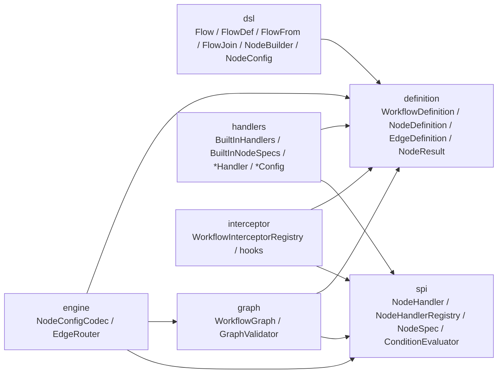

核心数据流：

1. DSL 构造 `WorkflowDefinition`。
2. `GraphValidator` 校验定义结构、handler 注册和 handler config 反序列化。
3. runtime 通过 `NodeConfigCodec.decode` 得到 typed config。
4. runtime 通过 `NodeConfigCodec.decodeState` 从 `businessData` 得到 handler 请求的 typed state。
5. runtime 调用 `NodeHandler.run(ctx, config, state)`；等待事件时先用三参 `canAccept` 过滤，再用 `decodeEventPayload` 得到 typed event payload。
6. runtime 调用 `NodeHandler.canAccept(ctx, event, config, eventPayload)` 和 `NodeHandler.onEvent(ctx, event, config, eventPayload)`。
7. runtime 用 `EdgeRouter.pickNextEdge` 决定下一个节点。

## DSL 构建链

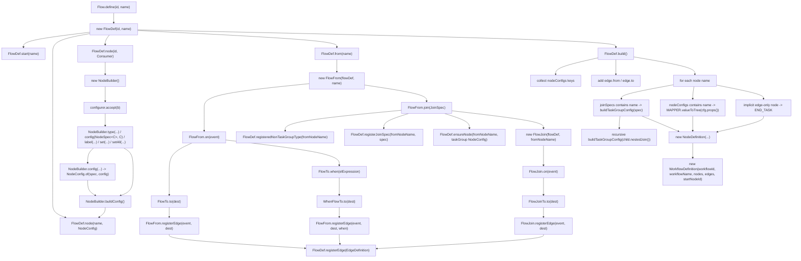

节点 config 类型边界：

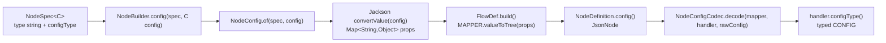

`NodeSpec<C>` 只约束 Java DSL 调用侧，`WorkflowDefinition` 仍保存 JSON；这保证可视化、持久化和跨 runtime 传输不依赖 Java 泛型。

DSL 静态工厂：

| 方法 | 直接创建/调用 |
|---|---|
| `Flow.define(String, String)` | `new FlowDef(...)` |
| `Dsl.node(String, NodeConfig)` | `new ChildNodeSpec(name, config)` |
| `Dsl.node(String, NodeConfig, JoinSpec)` | `new ChildNodeSpec(name, config, nestedJoin)` |
| `Dsl.node(String, Consumer<NodeBuilder>)` | `new NodeBuilder()` -> `configurer.accept(b)` -> `b.buildConfig()` -> `new ChildNodeSpec(...)`；子节点也可以在 builder 内调用 `NodeBuilder.config(NodeSpec<C>, C)` |
| `Dsl.all(ChildNodeSpec...)` | `new JoinSpec("all", Arrays.asList(nodes))` |
| `Dsl.any(ChildNodeSpec...)` | `new JoinSpec("any", Arrays.asList(nodes))` |
| `BuiltInNodes.service(...)` | returns `Consumer<NodeBuilder>` that calls `NodeBuilder.config(BuiltInNodeSpecs.SERVICE_TASK, new ServiceTaskConfig(...))` |
| `BuiltInNodes.approval(...)` | returns `Consumer<NodeBuilder>` that calls `NodeBuilder.config(BuiltInNodeSpecs.APPROVAL_TASK, new ApprovalTaskConfig(...))` |
| `BuiltInNodes.userTask(...)` | returns `Consumer<NodeBuilder>` that calls `NodeBuilder.config(BuiltInNodeSpecs.USER_TASK, new UserTaskConfig(...))` |
| `BuiltInNodes.event(...)` | returns `Consumer<NodeBuilder>` that calls `NodeBuilder.config(BuiltInNodeSpecs.EVENT_TASK, new EventTaskConfig(...))` |
| `BuiltInNodes.timer(...)` | returns `Consumer<NodeBuilder>` that calls `NodeBuilder.config(BuiltInNodeSpecs.TIMER_TASK, new TimerTaskConfig(...))` |
| `BuiltInNodes.subProcess(...)` | returns `Consumer<NodeBuilder>` that calls `NodeBuilder.config(BuiltInNodeSpecs.SUB_PROCESS, new SubProcessConfig(...))` |

`gateway` / `endTask` / `taskGroup` 没有额外配置 sugar。直接写 `b -> b.config(BuiltInNodeSpecs.GATEWAY, new GatewayConfig(...))`、`flow.endNode(name)`，或通过 `flow.from(name).join(...)` 生成 `taskGroup`。

## 定义模型

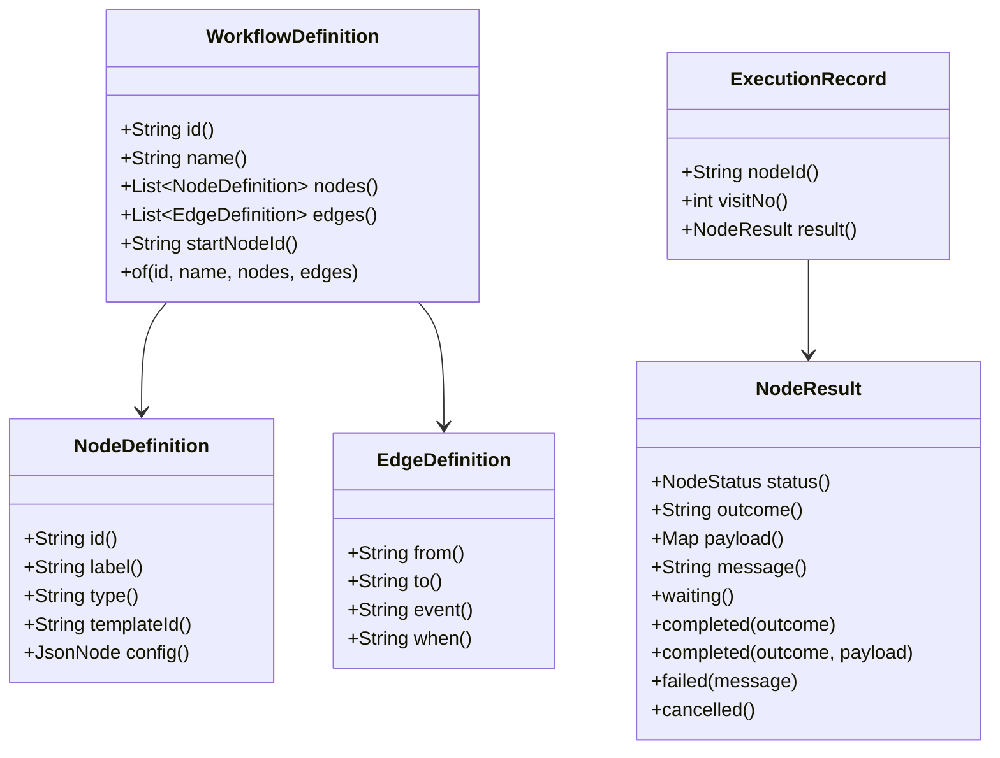

构造器校验：

| 记录 | 构造器行为 |
|---|---|
| `WorkflowDefinition` | 校验 `id`、`name`、`nodes`、`edges`，复制 list，校验非空 `startNodeId` 必须存在于 `nodes` |
| `NodeDefinition` | 校验 `id`、`type` |
| `EdgeDefinition` | 校验 `from`、`to` |
| `NodeResult` | 校验 `status`，复制 `payload`，`payload == null` 时转为 `Map.of()` |
| `ExecutionRecord` | 仅保存一次节点访问记录 |

## 图索引和校验

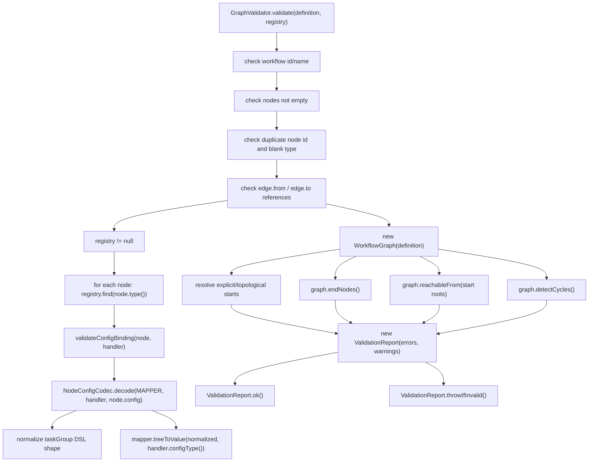

`GraphValidator.validate(definition, registry)` 的 registry 分支只校验节点 type 是否能找到 handler，以及节点 config 是否能绑定到 `handler.configType()`。边上的 `event` 是 `.on(...)` 写入的路由 key，不再要求 handler 预声明 outcome 集合。

`WorkflowGraph` 方法关系：

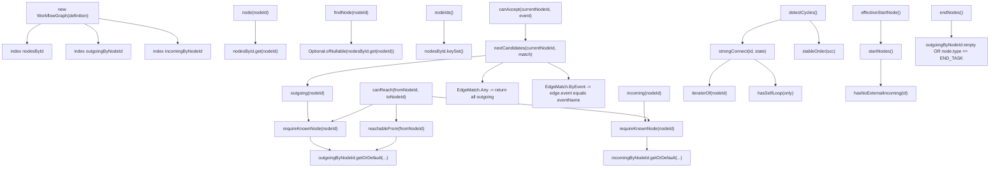

## engine 辅助逻辑

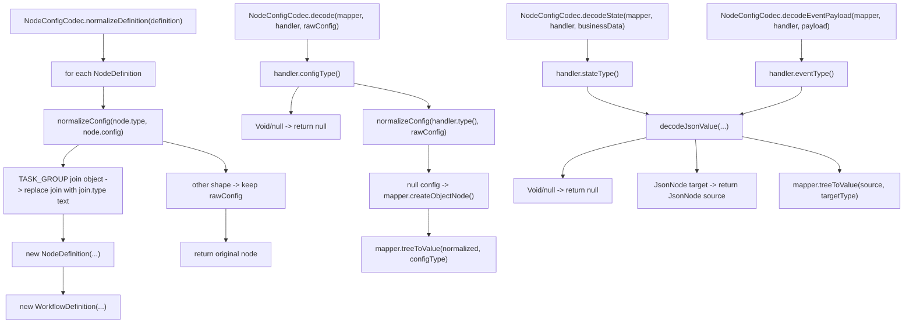

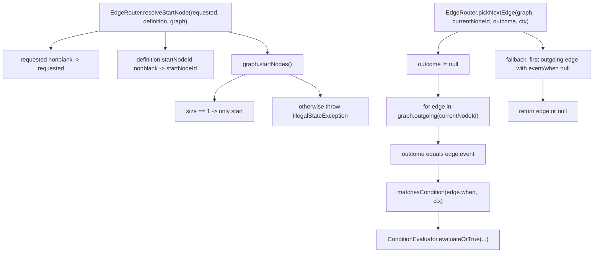

## SPI 注册、确定性扫描、条件表达式

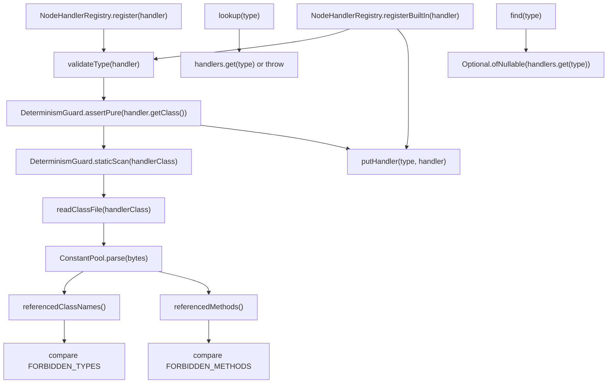

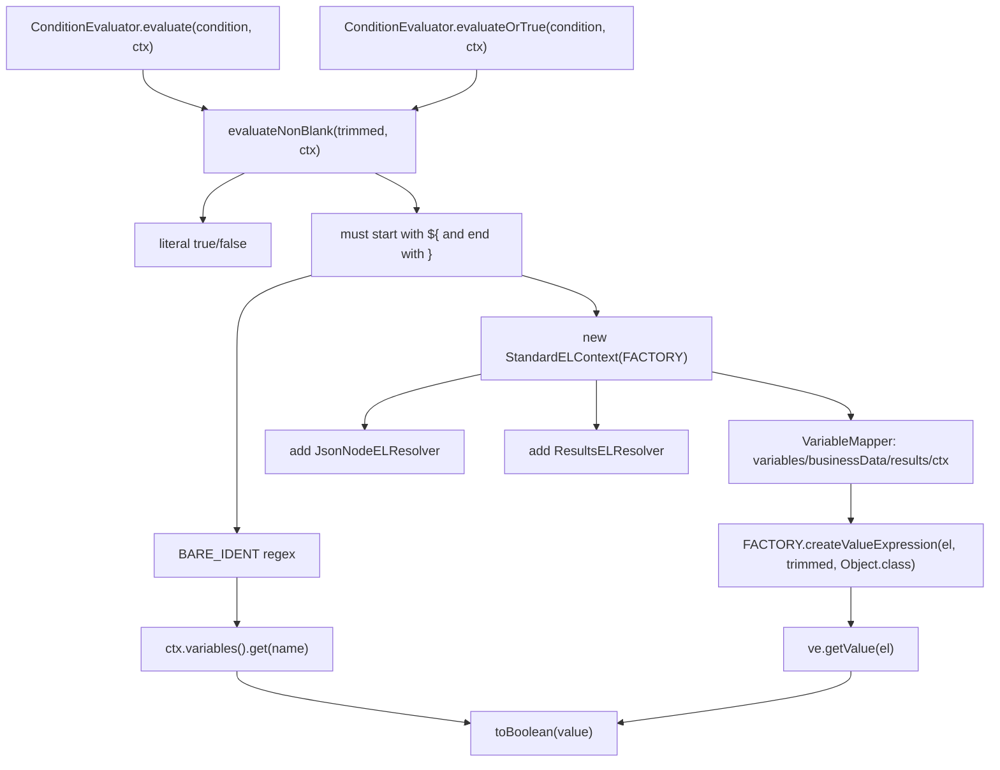

EL resolver 调用关系：

| 类 | `getValue` 输入 | 输出 |
|---|---|---|
| `JsonNodeELResolver` | `base instanceof JsonNode` + `property` | boolean/number/text scalar, or child `JsonNode` |
| `ResultsELResolver` | `base instanceof ConditionEvaluator.ResultsView` | `ResultsView.get(property.toString())` |
| `ResultsELResolver` | `base instanceof NodeResult` | `outcome` / `status` / `payload` / `message` / `payload.get(property)` |

## 内置 handler 统一执行模型

`NodeHandler<CONFIG, STATE, EVENT>` 的三个泛型只影响 Java 侧 handler 入口类型，不改变流程定义 JSON：

| 泛型 | JSON 来源 | 解码方法 | 主要入口 |
|---|---|---|---|
| `CONFIG` | `NodeDefinition.config()` | `NodeConfigCodec.decode(...)` | `run` / `canAccept` / `onEvent` / `compensate` |
| `STATE` | `NodeExecutionContext.businessData()` | `NodeConfigCodec.decodeState(...)` | `run(ctx, config, state)` / `compensate(ctx, config, completedResult, state)` |
| `EVENT` | `WorkflowEvent.payload()` | `NodeConfigCodec.decodeEventPayload(...)` | `canAccept(ctx, event, config, eventPayload)` / `onEvent(ctx, event, config, eventPayload)` |

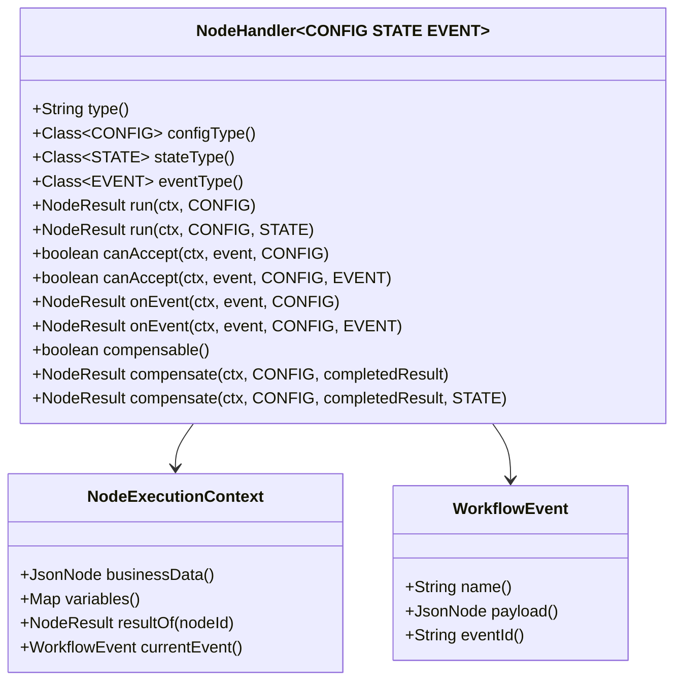

兼容关系：

1. 已有内置 handler 仍实现二参 `run(ctx, config)`、三参 `canAccept(ctx, event, config)`、三参 `onEvent(ctx, event, config)`。
2. runtime 调用 typed 重载；默认实现会回落到旧入口。
3. 自定义 handler 需要 typed state/event 时，覆盖 `stateType()` / `eventType()` 和对应 typed 重载即可。
4. 事件匹配顺序是三参 `canAccept` 先执行；只有返回 `true` 时才解码 `EVENT` 并调用四参 `canAccept`。

runtime 对 core handler 的典型调用顺序：

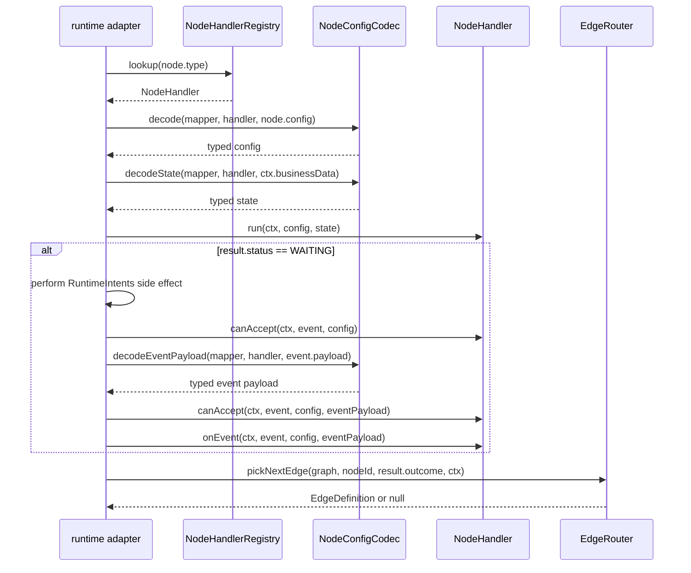

各内置 handler 方法关系：

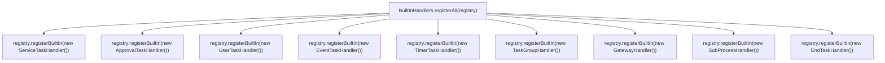

### `ServiceTaskHandler`

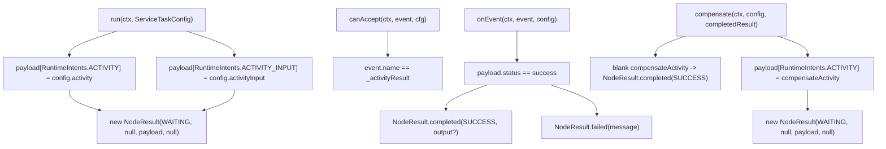

### `ApprovalTaskHandler`

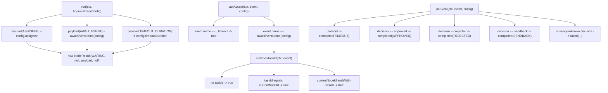

### `UserTaskHandler`

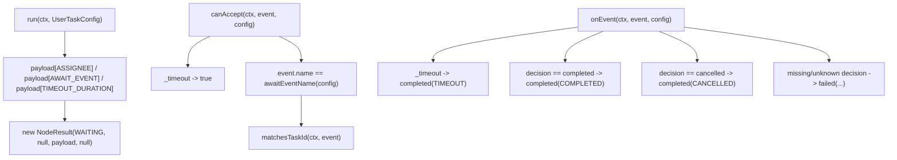

### `EventTaskHandler`

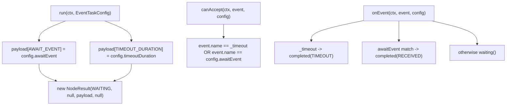

### `TimerTaskHandler`

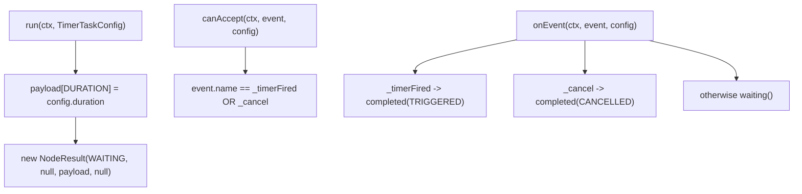

### `TaskGroupHandler`

```mermaid
flowchart TD
    A["run(ctx, TaskGroupConfig)"] --> B["effectiveJoinRule(config)"]
    B --> C["payload[JOIN_RULE] = rule.wireName()"]
    A --> D["serialize config.tasks into payload[CHILDREN]"]
    C --> E["new NodeResult(WAITING, null, payload, null)"]
    D --> E

    F["canAccept(ctx, event, cfg)"] --> G["event.name == _childCompleted"]
    H["onEvent(ctx, event, cfg)"] --> I["empty tasks -> completed(APPROVED)"]
    H --> J["effectiveJoinRule(cfg)"]
    J --> K["for each child -> ctx.resultOf(TaskGroupContract.childKey(parent, child.id))"]
    K --> L["aggregate(rule, childResults)"]
    L --> M["ALL: rejected/sendback short-circuit"]
    L --> N["ALL: all approved-like -> APPROVED, otherwise WAITING"]
    L --> O["ANY: first approved-like -> APPROVED"]
    L --> P["ANY: unfinished child -> WAITING"]
    L --> Q["ANY: all done and none approved -> REJECTED"]
```

### `GatewayHandler`

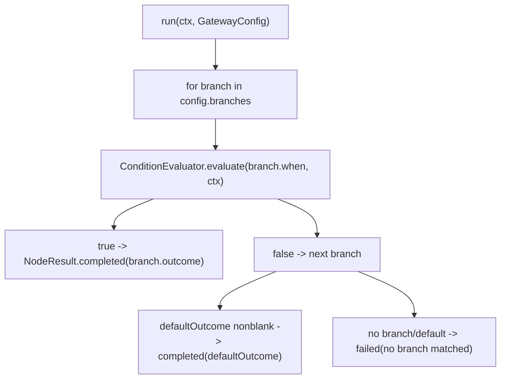

### `SubProcessHandler`

```mermaid
flowchart TD
    A["run(ctx, SubProcessConfig)"] --> B["payload[SUB_WORKFLOW_ID] = config.subWorkflowId"]
    A --> C["payload[SUB_DEFINITION_JSON] = config.definitionJson"]
    A --> D["payload[SUB_INPUT] = config.input"]
    B --> E["new NodeResult(WAITING, null, payload, null)"]
    C --> E
    D --> E
    F["canAccept(ctx, event, cfg)"] --> G["event.name == _subProcessCompleted"]
    H["onEvent(ctx, event, cfg)"] --> I["payload.subOutcome missing -> failed(...)"]
    H --> J["cfg.outcomeMapping overrides subOutcome"]
    J --> K["NodeResult.completed(mapped)"]
```

### `EndTaskHandler`

```mermaid
flowchart TD
    A["run(ctx, EndTaskConfig)"] --> B["NodeResult.completed(COMPLETED)"]
```

## interceptor

```mermaid
flowchart TD
    A["WorkflowInterceptorRegistry.register(interceptor)"] --> B["interceptor instanceof DeterministicInterceptor"]
    A --> C["interceptor instanceof AsyncInterceptor"]
    B --> D["insertSorted(deterministic, di)"]
    C --> E["insertSorted(async, ai)"]
    A --> F["neither -> IllegalArgumentException"]
    G["deterministic()"] --> H["List.copyOf(deterministic)"]
    I["async()"] --> J["List.copyOf(async)"]
    K["clear()"] --> L["deterministic.clear(); async.clear()"]
```

Hook 方法名在两个接口中一致：

| 接口 | hook 方法 |
|---|---|
| `DeterministicInterceptor` | `onWorkflowStart` / `onWorkflowEnd` / `onNodeEnter` / `onNodeExit` / `onNodeError` / `onEvent` / `onCompensate` |
| `AsyncInterceptor` | `onWorkflowStart` / `onWorkflowEnd` / `onNodeEnter` / `onNodeExit` / `onNodeError` / `onEvent` / `onCompensate` |

## 修改入口索引

| 要改的能力 | 主要文件 | 先看方法 |
|---|---|---|
| 新增内置节点类型 | `handlers/*Handler.java`, `handlers/*Config.java`, `spi/NodeTypes.java`, `spi/BuiltInNodeType.java`, `spi/NodeSpec.java`, `handlers/BuiltInNodeSpecs.java`, `handlers/BuiltInHandlers.java`, `dsl/BuiltInNodes.java` | `NodeHandler.run`, `NodeHandler.canAccept`, `NodeHandler.onEvent`, `BuiltInHandlers.registerAll` |
| 修改 handler 泛型输入 | `spi/NodeHandler.java`, `engine/NodeConfigCodec.java` | `configType`, `stateType`, `eventType`, `decode`, `decodeState`, `decodeEventPayload` |
| 修改 DSL 输出 JSON | `dsl/FlowDef.java`, `dsl/NodeBuilder.java`, `dsl/NodeConfig.java`, `dsl/Dsl.java` | `FlowDef.build`, `FlowDef.buildTaskGroupConfig`, `NodeConfig.of`, `NodeBuilder.buildConfig` |
| 修改流程图校验 | `graph/GraphValidator.java`, `graph/WorkflowGraph.java` | `GraphValidator.validate`, `GraphValidator.validateNodeConfig`, `WorkflowGraph.detectCycles` |
| 修改路由规则 | `engine/EdgeRouter.java`, `graph/WorkflowGraph.java` | `EdgeRouter.pickNextEdge`, `WorkflowGraph.nextCandidates` |
| 修改表达式能力 | `spi/ConditionEvaluator.java`, `spi/JsonNodeELResolver.java`, `spi/ResultsELResolver.java` | `ConditionEvaluator.evaluateNonBlank`, resolver `getValue` |
| 修改自定义 handler 注册规则 | `spi/NodeHandlerRegistry.java`, `spi/DeterminismGuard.java` | `NodeHandlerRegistry.register`, `DeterminismGuard.staticScan` |
| 修改会签聚合 | `handlers/TaskGroupHandler.java`, `handlers/TaskGroupContract.java` | `TaskGroupHandler.onEvent`, `TaskGroupHandler.aggregate`, `TaskGroupContract.childKey` |
| 修改生命周期 hook | `interceptor/*` | `WorkflowInterceptorRegistry.register`, `insertSorted` |
